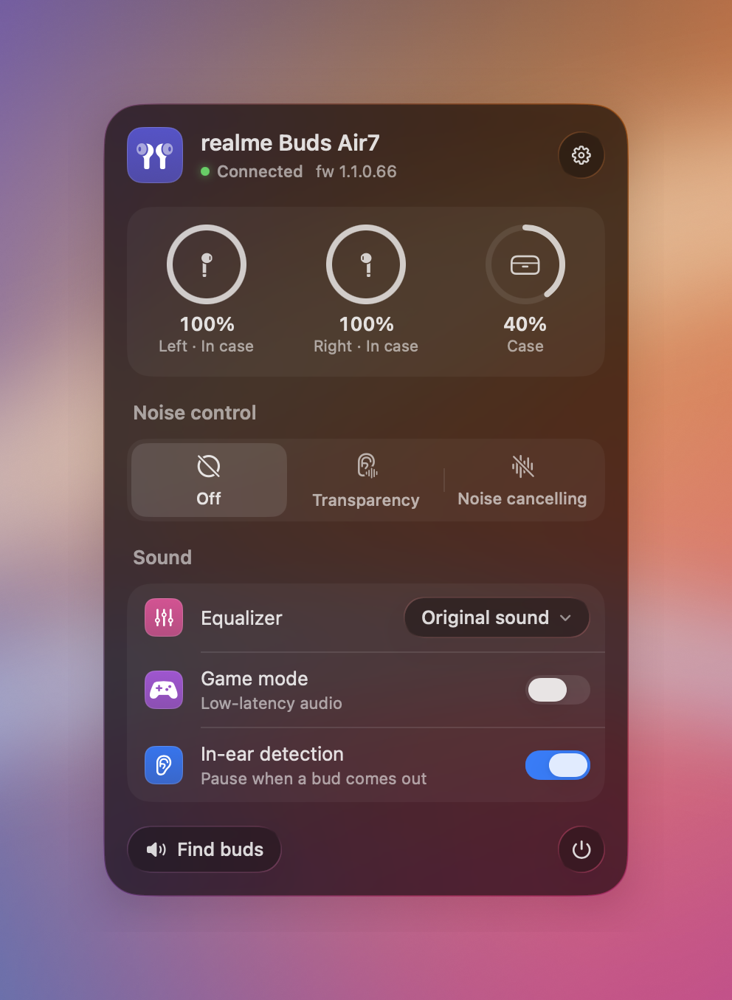
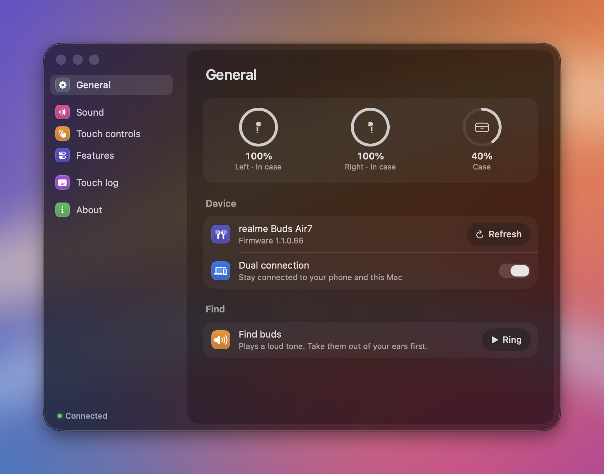
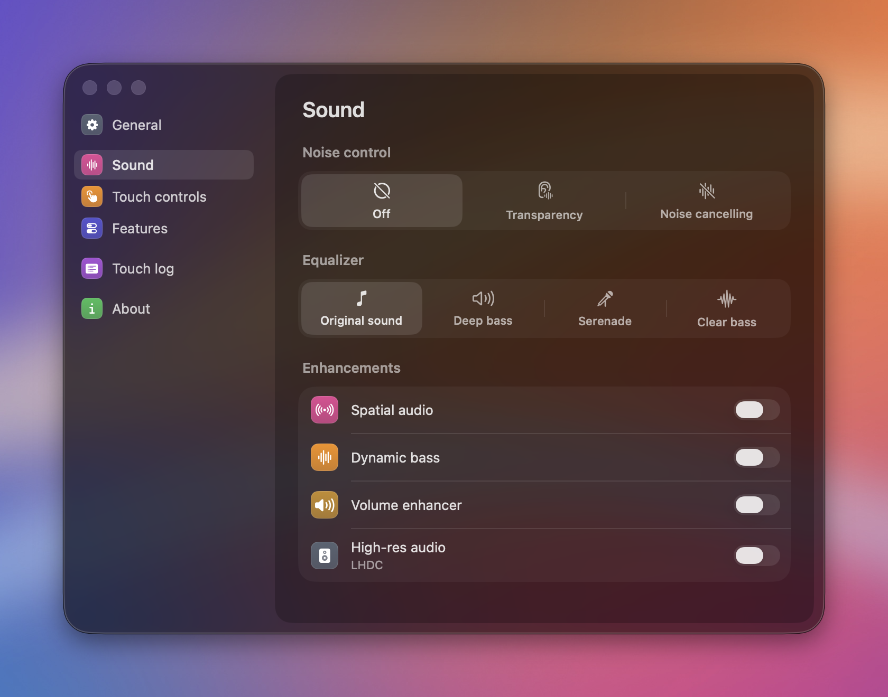
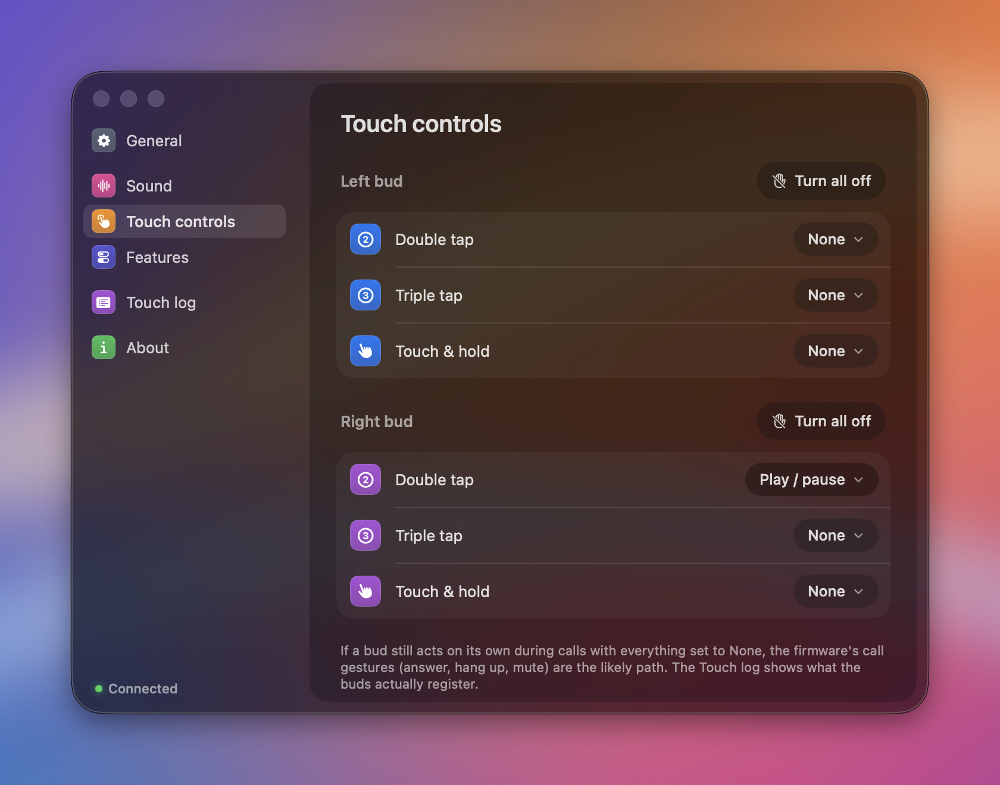
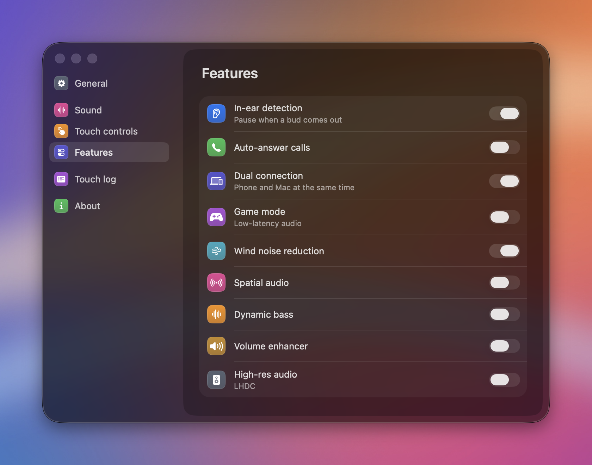

# realme Buds for Mac

A menu bar app for realme earbuds on macOS. It shows battery for each bud and the case, switches noise control, and changes the settings that normally live in the realme Link phone app. It talks to the buds directly over Bluetooth, so there's no phone in the loop.

<p align="center">
  
</p>

I bought a pair of Buds Air 7 for work and the left bud kept "double tapping" on its own during calls. realme Link said every left gesture was already off. I wanted to see what the buds were actually doing, so I started reading their Bluetooth protocol, and this is where that ended up.

## What it does

The menu bar icon shows the lower of the two bud batteries. Clicking it opens a panel with:

- battery rings for left, right and case, with charging state and whether each bud is in your ear
- noise control (off, transparency, noise cancelling) and the four ANC levels
- equalizer preset, game mode and in-ear detection
- the last touch the buds registered
- find my buds, which plays a loud tone

The settings window has everything else.

| | |
|---|---|
|  |  |
|  |  |

- **Touch controls.** Set double tap, triple tap and touch-and-hold for each bud, or turn a bud's gestures off in one click.
- **Features.** In-ear detection, auto-answer, dual connection, game mode, wind noise reduction, spatial audio, dynamic bass, volume enhancer and high-res audio.
- **Touch log.** A live list of every touch the buds report and every time a bud goes in or out of your ear. If a bud acts on its own, this tells you whether the touch sensor fired or the wear sensor flickered.

## Supported buds

I've only tested it on the **realme Buds Air 7** (firmware 1.1.0.66). Battery, placement and the touch log use a message format that realme, OPPO and OnePlus share, so those should work on other realme and OPPO buds that expose the `oppointeraction` service. Noise control values, gesture options and feature switches differ between models, and the app doesn't read the model ID yet, so on anything else treat those as untested. Most OnePlus buds speak the same protocol over Bluetooth LE instead, which this app doesn't do.

If you have another model and it connects, an issue with the output of `BUDS_TRACE=1` (see below) is the most useful thing you can send.

## Install

Needs macOS 26 and the Xcode Command Line Tools. Full Xcode isn't required.

```sh
git clone https://github.com/kalki-kgp/realme-buds-mac.git
cd realme-buds-mac/App
./build.sh
cp -R Buds.app /Applications/ && open /Applications/Buds.app
```

Pair the buds with your Mac in System Settings first. The first launch asks for Bluetooth access. If you use a menu bar manager, the icon may start out in its hidden section.

Only one program on the Mac can hold the buds' control channel at a time, so quit the app before using the CLI below.

## Command line

`cli/buds.swift` is the tool I used to work out the protocol. It prints everything the buds report and then logs touches live.

```sh
swift cli/buds.swift                       # read state, then log touches
swift cli/buds.swift set L double none     # L|R  double|triple|hold  <action>
swift cli/buds.swift left-off              # every left gesture to none
swift cli/buds.swift feature in-ear off
swift cli/buds.swift restore <hex>         # put back the gestures it printed at start
```

## How it works

The buds advertise an RFCOMM service called `oppointeraction` (UUID `0000079A-D102-11E1-9B23-00025B00A5A5`). Frames look like this:

```
aa <len> 00 00 <cmd lo> <cmd hi> <seq> <payload len u16le> <payload…>
```

Replies set the high bit of the command and put a status byte first. The buds push battery, placement, noise mode and touch events on command `0x0204` once you subscribe with `0x0205`. The full command table is in [`BudsClient.swift`](App/Sources/BudsClient.swift).

Nothing here opens the buds' `BESOTA` firmware update service. A bad write there could brick them.

For development, `BUDS_TRACE=1` logs the Bluetooth traffic, `BUDS_OPEN=panel` or `BUDS_OPEN=settings:touch` opens a surface at launch, and `BUDS_STAGE=docs/src/backdrop.jpg` puts that image behind the app for screenshots.

## Credits

- The command table comes from [maniacx/BudsLink](https://github.com/maniacx/BudsLink), which already supports the Air 7 on Linux. No code was copied, but I'd have been guessing without it.
- [anikket-b/Realme-TWS-Mac-Controller](https://github.com/anikket-b/Realme-TWS-Mac-Controller) worked out the RFCOMM side on macOS and the IOBluetooth quirks.
- The UI components are ported from [Droppy Code](https://gitlab.com/droppyformac1/droppy-code) (MIT, © T3 Tools Inc. and Jordy Spruit). Their notice is in [`App/LICENSE-droppy-code`](App/LICENSE-droppy-code). This project isn't affiliated with Droppy.

Not affiliated with realme, OPPO or OnePlus.

## License

MIT. See [LICENSE](LICENSE).
